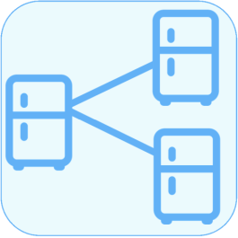
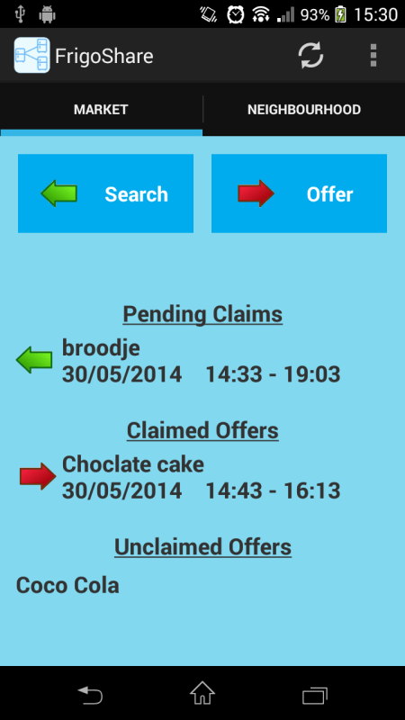
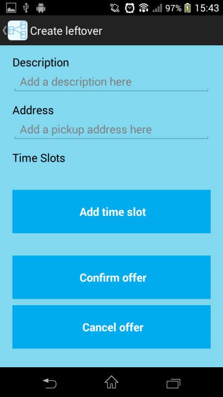
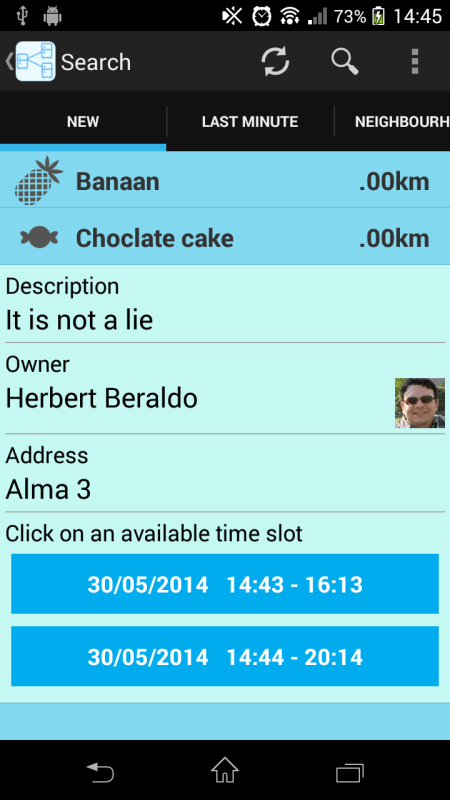

# [FrigoShare](https://play.google.com/store/apps/details?id=com.frigoshare)

Course User Interfaces: [Android application](https://play.google.com/store/apps/details?id=com.frigoshare) with Google App Engine backend that allows students to share (food) leftovers.

Team [anarCHI](https://anarchikul.wordpress.com/):
* [Herbert Beraldo](https://github.com/hb-FA37) (Computer Science)
* [Matthias Moulin](https://github.com/matt77hias) (Computer Science)
* [Ruben Pieters](https://github.com/rubenpieters) (Computer Science)

**Academic Year**: 2013-2014 (2nd semester - 1st Master of Science in Engineering: Computer Science)

## About
FrigoShare is an [Android application](https://play.google.com/store/apps/details?id=com.frigoshare) using Google App Engine as backend that allows people to share (food) leftovers with friends, instead of throwing them away or noticing something living in your fridge.

## Dependencies
* [socialauth](https://github.com/3pillarlabs/socialauth) [[MIT License](https://github.com/3pillarlabs/socialauth/blob/master/LICENSE)]
* [socialauth-android](https://github.com/3pillarlabs/socialauth-android) [[MIT License](https://github.com/3pillarlabs/socialauth-android/blob/master/LICENSE)]

## Privacy Policy
* [FrigoShare](https://matt77hias.github.io/FrigoShare/)
